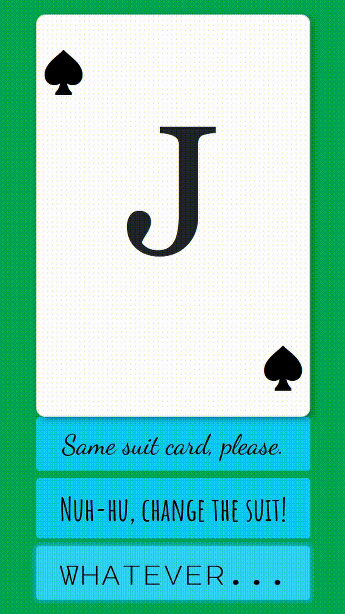

# Random Card Generator

## Intro

We had to do a random card generator following this model:

[](http://https://raw.githubusercontent.com/breatheco-de/exercise-random-card/master/preview.gif "Base random card generator")

But as our teacher decided to complicate it a little bit he decided to ask us for a button to change between non used cards.

Alas, _or not_, :stuck_out_tongue: I wanted to complicate it a little bit more.

## HTML

We only have a bootstrap grid to place the card and the **three** buttons aligned all along.

## CSS

With a found _desk interpreter_ on google, I only had real interaction with the `styles` content to personalize a little bit the main buttons.

## JavaScript

**There are the steps followed in JS:**

## 1. Onloading a random poker card

First I needed to create a deck, so I writed the two needed arrays and also did am `arrow function` called "deckCreator".

This function had to return an `array` of `objects` that saved:

1. The value of the card (A, 2, 3, etc.)
2. The card's suit (diamonds, hearts, ...)
3. And finaly, a `boolean` that told us if the card was used or not. Of course, default setted in false.

```JavaScript
const cardsValues = ["A", 2, 3, 4, 5, 6, 7, 8, 9, 10, "J", "Q", "K"];
const cardsSuits = ["suitdiamonds", "suithearts", "suitclubs", "suitspades"];
const deckCreator = (arrS, arrV) => {
  function Card(value, suit, boolean) {
    this.value = value,
	this.suit = suit,
	this.used = boolean;
  }
  let deck = [];
  for (let i in arrS) {
    for (let j in arrV) {
      deck.push(
	  	new Card(
			String(arrV[j]),
			String(arrS[i]),
			false));
    }
  }
  return deck;
};
```

With a simple `random number generator` to seek and store the first card I used a `displayCard arrow function` with DOM uses in it.

```JavaScript
const displayCard = card => {
  cardHTML.classList.remove(cardHTML.classList[1]);
  cardHTML.classList.add(card.suit);
  cardHTML.innerHTML = `<p>${card.value}</p>`;
  card.used = true;
  randomCard = card;
  notUsedDeck = deck.filter(usedDeckFilter);
  noMoreCards(notUsedDeck, card, deck);
};
```

As shown inside, I used a DOM token called `classList` to substitute the style of the shown card for the new generated one's style and then show it at the innerHTML of the card container.

## 2. Don't ever repeat a card shown

Due to that sentence I created a general array called `notUsedDeck` with all the `{used: false}` of the main `deck` array.

This `notUsedDeck` is the array from all the new shown cards are originated, then in all the new `creation cards functions` will be used.

As you can recognise those functions will always cross the `displayCard` function. To ensure not repeating coding lines and minimize the length of each function I concentrated all the filters and changes that must be done on this one. For it each time called changes the value of the `card.used` to `true`, then stores the new shown card in the first random card variable called `randomCard`. Finally the `notUsedDeck` is updated.

### No More Cards Function

But then you may observe a new method (function inside a function) called `noMoreCards()`. To ensure not repeating coding lines and minimize the length of each function I concentrated all the filters and changes that must be done on this one. For it each time called changes the value of the `card.used` to `true`, then stores the new shown card in the first random card variable called `randomCard`. Finally the `notUsedDeck` is updated.

For all that I decided to describe it as a **`Protocol`** function.

```JavaScript
const noMoreCards = (arr, card, bigArr) =>
  arr.length !== 1
    ? (card.used = true) &&
      (randomCard = card) &&
      (notUsedDeck = deck.filter(usedDeckFilter))
    : bigArr.forEach(object => (object.used = false));
```

This important function makes that every time all the deck is shuffled and only the shown card remains it sets all the `object.used` inside the deck 's array to false again to endlessly shuffle cards not repeated untill the `notUsedDeck` is all shuffled.

## 3. Filtered Card Generators

I created and used a pair twins function that generates a **card** filtered by the value or by the suit of the previous shown card, (that's why `noMoreCards()` method updates `randomCard`).

```JavaScript
const sameSuit = () => {
  const sameSuitDeck = notUsedDeck.filter(object = object.suit == randomCard.suit);

  const sameSuitCard = () =>
    sameSuitDeck.length !== 0
      ? sameSuitDeck[randomIndex(sameSuitDeck)]
      : newRandomCard();
  return sameSuitCard();
};
```

They have two steps:

### 1. Deck creation

With a simple array `.filter` method letting just _come in_ the same suit, or value -- depending of each one -- a new array with the same parameter is created for the right card be chosen inside it.

### 2. Card generation

I created a ternary expression that retrieved me **yes or yes** a card. If there were no more cards that matches the suit or the value it just brings out a new random card using the `newRandomCard()` function as simple as it is.

```JavaScript
const newRandomCard = () => notUsedDeck[randomIndex(notUsedDeck)];
```

Get a new index number from the not used deck and **_"VOILÀ!"_**, no more `undefined` issues!

# Final Result


---

## How to run it

It should run automatically but, if not, just run:

1. `npm install`
2. `npm run start`

---

> _Thank you very much for reading,
> Aslan at your service_
